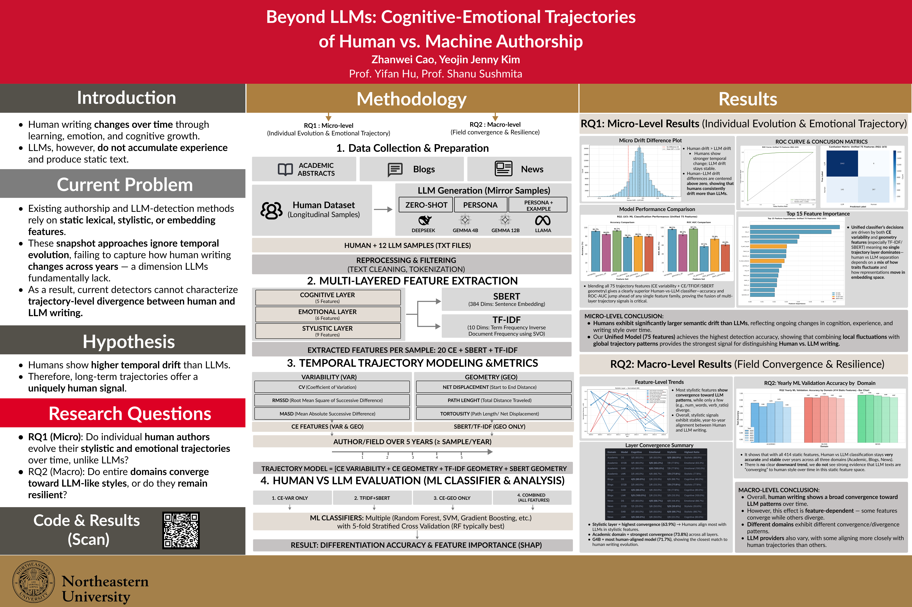

# LLM Dataset Generation Pipeline — cogfingerprint-llm 
**Cognitive Fingerprinting Dataset Generator — Multi-Level Human→LLM Parallel Text Pipeline**

## Overview

### Project Overview Video

[](https://www.youtube.com/watch?v=WxAqoJS3dLU)

*Click the image above to watch the project overview video on YouTube.*

### Research Poster



*Research poster: "Beyond LLMs: Cognitive-Emotional Trajectories of Human vs. Machine Authorship"*

This repository builds a **3-Level LLM dataset pipeline** that mirrors human cognitive trajectories in text writing.  
For each *Human* text (Academic / Blogs / News), the pipeline generates **Level 1–3 LLM counterparts** using  
incremental prompt guidance (zero-shot → persona → persona + few-shot examples).

Each file produces:
-  **5 Keywords**
-  **1-Sentence Summary**
-  **Word Count**
-  **LLM-Generated Texts (LV1–LV3)**

---

## Research Questions

This project addresses two main research questions:

- **RQ1 (Micro-level)**: How do human authors and LLMs differ in their cognitive trajectories at the individual author level? We analyze trajectory features (variability + geometry) across multiple representation spaces (CE, TF-IDF, SBERT) to identify systematic differences.

- **RQ2 (Macro-level)**: How do human and LLM trajectories differ at the domain level over time? We examine temporal drift patterns, between-source distances, and convergence/divergence trends from 2020-2024.

---

## Dataset Structure

```
cogfingerprint-llm/
 ├── dataset/                     # Micro dataset (human + generated LLM txt)
 │   ├── human/<genre>/<field>/...
 │   └── llm/<model>/<level>/<genre>/...
 │
 ├── dataset/process/             # Micro features & stats
 │   ├── human/<domain>/big5.csv
 │   ├── human/<domain>/nela_merged.csv
 │   ├── human/<domain>/combined_merged.csv
 │   └── LLM/<MODEL>/<LV>/<domain>/...
 │
 ├── macro_dataset/               # Macro dataset mirrors the same structure
 │   ├── human/<domain>/...
 │   └── LLM/<MODEL>/<LV>/<domain>/...
 │
 ├── scripts/
 │   ├── micro/                   # Micro pipelines (feature extraction, ML, binomial, etc.)
 │   ├── macro/                   # Macro pipelines (static classification, RQ2, etc.)
 │   ├── generation/
 │   │   ├── micro/               # CLI entry points per genre (Academic / Blogs / News)
 │   │   └── macro/               # Macro-level generation CLIs
 │   ├── visualization/           # Plotting helpers
 │   └── tools/                   # Misc utilities (e.g., quick tests)
 │
 ├── docs/                        # Methodology + cleanup notes
 ├── utils/                       # Shared helpers (API, prompts, metadata parsing, etc.)
 ├── macro_results/               # Aggregated macro experiment outputs
 ├── micro_results/               # Aggregated micro ML/Binomial outputs
 ├── config.py
 ├── main.py (legacy aggregator)
 └── main_refactored.py (legacy aggregator)
```

---

## Dataset Scale

- **Micro Dataset**: ~6,000 samples total
  - Academic: ~500 samples
  - Blogs: ~1,900 samples  
  - News: ~3,700 samples
  - Each sample has corresponding LLM-generated texts (4 models × 3 levels = 12 variants per human text)

- **Macro Dataset**: Domain-level aggregation
  - Each domain treated as a "big author"
  - ~1,000 samples per year per domain
  - Temporal analysis across 2020-2024

---

##  Architecture

```
cogfingerprint-llm/
│
├── scripts/
│   ├── generation/micro/        # Genre-specific CLI (generate_*_cli.py)
│   ├── generation/macro/        # Macro-level CLI (generate_macro_*_cli.py)
│   ├── micro/                   # batch_analyze_metrics, remove_outliers, ML/Binomial, etc.
│   └── macro/                   # analyze_macro_metrics, ml_classify_macro_static, etc.
│
├── utils/
│   ├── api_utils.py            # Unified LLM API handler (DeepSeek / Gemma / Llama / OpenRouter)
│   ├── extract_utils.py        # Keyword, summary, word-count extractor via JSON parsing
│   ├── prompt_utils.py         # Prompt templates for all genres & levels
│   ├── file_utils.py           # Metadata parsing & filename builders
│   └── topic_utils.py          # (Optional) Topic extractor using OpenAI GPT-4o-mini
│
├── Datasets/
│   ├── Human/...               # Human source corpus by genre / subfield / year
│   └── LLM/...                 # Generated parallel texts (LV1–3)
│
└── config.py                   # API key management
```

---

##  Setup

### 1. Environment
```bash
python -m venv .venv
source .venv/bin/activate
pip install requests openai
```

### 2. API Keys

Create a `.env` file or export keys directly:

```bash
export OPENROUTER_API_KEY="sk-or-xxxxxxxxxxxx"
export DEEPSEEK_API_KEY="sk-deepseek-xxxxxxxxxxxx"
export OPENAI_API_KEY="sk-openai-xxxxxxxxxxxx"
```

### 3. Select Provider
Default = `DEEPSEEK`  
You can override by setting:

```bash
export LLM_PROVIDER="GEMMA_4B"
# or GEMMA_12B / LLAMA_MAVRICK / DEEPSEEK
```

---

## Feature Extraction

The pipeline extracts three types of features:

### 1. Static Features (414 total)
- **CE Features (20)**: Big5 personality traits, sentiment (VADER), readability (Flesch, Gunning Fog), lexical statistics
- **TF-IDF Features (10)**: SVD-reduced TF-IDF vectors (max_features=20,000 → 10 dims)
- **SBERT Features (384)**: Semantic embeddings using `all-MiniLM-L6-v2`

### 2. Trajectory Features (75 unified features)
Trajectory features capture temporal patterns in author writing:

- **CE Variability (60 features)**: For each of 20 CE features, compute 3 variability metrics:
  - `_cv`: Coefficient of Variation
  - `_rmssd_norm`: Normalized Root Mean Square of Successive Differences
  - `_masd_norm`: Normalized Mean Absolute Successive Difference

- **Geometry Features (15 features)**: For CE, TF-IDF, and SBERT spaces (5 each):
  - `mean_distance`: Average yearly step distance
  - `std_distance`: Standard deviation of distances
  - `net_displacement`: Total displacement from first to last year
  - `path_length`: Cumulative path length
  - `tortuosity`: Path length / net displacement

These 75 unified trajectory features form the basis for RQ1 analysis.

---

##  Extraction Levels

| Level | Description | Prompt Style |
|--------|--------------|--------------|
| LV1 | Zero-shot baseline | Simple extraction without persona |
| LV2 | Genre-based persona | Adds stylistic guidance per genre |
| LV3 | Persona + few-shot examples | Adds contextual examples for stronger fidelity |

---

##  Model Support

| Provider | Model ID | Endpoint | Notes |
|-----------|-----------|-----------|--------|
| **DeepSeek** | `deepseek-chat` | `https://api.deepseek.com/v1` | Default fast model |
| **Gemma-4B** | `google/gemma-3-4b-it` | OpenRouter | Paid tier only |
| **Gemma-12B** | `google/gemma-3-12b-it` | OpenRouter | Stronger reasoning |
| **Llama-4 Maverick** | `meta-llama/llama-4-maverick` | OpenRouter | Used for LV1–3 fallback |

---

##  Run Pipeline

1. **Generate LLM texts per genre** (micro dataset):
   ```bash
   # Academic / Blogs / News share the same flags (model, levels, workers, etc.)
   python scripts/generation/micro/generate_academic_cli.py --model GEMMA_12B --levels 1 2 3
   python scripts/generation/micro/generate_blogs_cli.py --model DEEPSEEK --levels 1
   python scripts/generation/micro/generate_news_cli.py --model LLAMA_MAVRICK --levels 1 2 3
   ```

2. **Generate macro-level LLM texts** (macro dataset):
   ```bash
   python scripts/generation/macro/generate_macro_news_cli.py --model GEMMA_12B --levels 1 2 3
   # ... similarly for Blogs / Academic
   ```

3. **Batch feature extraction (CE features: Big5 + NELA)**
   ```bash
   python scripts/micro/batch_analyze_metrics.py                 # runs across all micro domains/models/levels
   python scripts/macro/analyze_macro_metrics.py --target llm ... # macro dataset per-domain
   ```

4. **Extract TF-IDF and SBERT embeddings**
   ```bash
   python scripts/micro/tfidf/extract_tfidf_vectors.py            # per-sample TF-IDF vectors
   python scripts/micro/sbert/extract_sbert_vectors.py           # per-sample SBERT vectors
   python scripts/micro/tfidf/aggregate_tfidf_yearly.py          # aggregate to author-year level
   python scripts/micro/sbert/aggregate_sbert_yearly.py          # aggregate to author-year level
   ```

5. **Outlier removal → time series stats**
   ```bash
   python scripts/micro/remove_outliers_from_combined_merged.py --input dataset/process/LLM/G12B/LV1/news/combined_merged.csv
   python scripts/micro/generate_timeseries_stats_from_outliers_removed.py --target llm --models G12B GEMMA_12B
   ```

6. **Compute trajectory features (RQ1)**
   ```bash
   # Micro-level trajectory features
   python scripts/micro/trajectory/compute_ce_trajectory_features.py
   python scripts/micro/trajectory/compute_embedding_trajectory_features.py
   python scripts/micro/trajectory/build_combined_trajectory_features.py
   
   # Macro-level trajectory features (RQ2)
   python scripts/macro/trajectory/compute_macro_trajectory_features.py --level LV3
   ```

7. **ML validation + Statistical tests**
   ```bash
   # Static feature classification
   python scripts/micro/ml_classify_micro_static_by_level.py --levels LV1 LV2 LV3
   
   # Trajectory feature classification
   python scripts/micro/analysis/run_trajectory_classification.py
   
   # Binomial tests
   python scripts/micro/binomial_test_trajectory_features.py --level LV3
   python scripts/micro/binomial_test_representation_pipeline.py --level LV3
   ```

8. **RQ2 Macro analysis**
   ```bash
   # Yearly ML validation
   python scripts/macro/ml_classify_macro_yearly_rq2.py
   
   # Trajectory drift analysis
   python scripts/macro/analyze_rq2_macro_trajectory.py
   
   # Feature convergence analysis
   python scripts/macro/analyze_ce_feature_convergence.py
   ```

> `main.py` / `main_refactored.py` are legacy wrappers that batch all genres/levels. Use the CLI scripts above for new runs.

---

## Analysis Methods

### Static Feature Analysis
- **ML Classification**: Binary Human vs LLM classification using 414 static features (CE + TF-IDF + SBERT)
- **Feature Importance**: Identify most discriminative features across levels (LV1-LV3)
- **Per-Level Comparison**: Evaluate classification performance separately for each level

### Trajectory Feature Analysis (RQ1)
- **Trajectory Completeness**: Analyze whether multiple representation spaces (CE/TF-IDF/SBERT) are necessary
- **Binomial Tests**: Systematic comparison of Human vs LLM trajectory features
  - Tests whether Human values are significantly higher than LLM values
  - Per-feature and per-feature-group analysis
- **Trajectory Classification**: ML classification using 75 unified trajectory features
- **Visualization**: PCA, feature importance plots, per-feature binomial test results

### Macro-Level Analysis (RQ2)
- **Within-Source Drift**: Measure temporal stability of Human and LLM trajectories
- **Between-Source Distance**: Track Human-LLM separation over time (2020-2024)
- **Yearly ML Validation**: Evaluate classification performance per year
- **Feature Convergence**: Analyze whether Human and LLM features converge over time
- **Trajectory Visualization**: Drift comparison plots, distance trends, convergence analysis

---

## Results & Outputs

### Micro Results (`micro_results/`)
- **`binomial/`**: Binomial test results for trajectory features and representation pipeline features
  - Per-level results (LV1, LV2, LV3)
  - Detailed comparisons and summary statistics
- **`ml/`**: ML classification results
  - Feature importance rankings
  - Classification performance metrics (accuracy, ROC-AUC, F1)
  - Logistic regression p-values
- **`micro_static_ml_by_level/`**: Static feature ML validation by level
  - Results summary with per-level and per-domain breakdowns

### Macro Results (`macro_results/`)
- **`rq2_macro_trajectory/`**: Macro trajectory analysis results
  - `within_source_drift.csv`: Human and LLM drift over time
  - `between_source_distance.csv`: Human-LLM separation trends
- **`rq2_yearly_ml_validation/`**: Yearly classification performance
  - Results for all features and CE-only features
- **`rq2_ce_feature_convergence/`**: Feature convergence analysis
  - Convergence metrics per domain and overall
- **`yearly_static_ml_validation*.csv`**: Yearly static feature classification results
- **`feature_importance_*.csv`**: Feature importance rankings by level

### Visualization Outputs (`plots/`)
- **`trajectory/`**: Trajectory feature visualizations
  - PCA plots, feature importance, binomial test results
- **`macro/`**: Macro-level analysis plots
  - Trajectory features by model, drift comparisons
- **`rq2_macro_trajectory/`**: RQ2 trajectory analysis plots
  - Within-source drift, between-source distance, combined summaries
- **`rq2_yearly_ml_validation/`**: Yearly validation plots

---

## Generator CLI Usage

### Micro dataset

| Flag | Meaning | Default |
|------|---------|---------|
| `--model {DEEPSEEK,GEMMA_4B,GEMMA_12B,LLAMA_MAVRICK}` | LLM provider/model tag | value from `.env` or `DEEPSEEK` |
| `--levels ...` | List of levels to run (space separated) | `1 2 3` |
| `--human-dir` | Source directory (`dataset/human`) | `dataset/human` |
| `--llm-dir` | Output directory (`dataset/llm`) | `dataset/llm` |
| `--workers` | Concurrent worker threads | `5` |
| `--verbose` | Show per-file progress | off |

Examples:

```bash
# Academic LV1-3 using Gemma 12B
python scripts/generation/micro/generate_academic_cli.py --model GEMMA_12B --levels 1 2 3

# Blogs LV1 only, verbose logging
python scripts/generation/micro/generate_blogs_cli.py --model DEEPSEEK --levels 1 --verbose

# News LV2 with more workers
python scripts/generation/micro/generate_news_cli.py --model LLAMA_MAVRICK --levels 2 --workers 10
```

### Macro dataset

Macro CLIs mirror the same flags but default to `macro_dataset/human` / `macro_dataset/llm`:

```bash
python scripts/generation/macro/generate_macro_news_cli.py --model GEMMA_12B --levels 1 2 3 --workers 8
```

### Handling moderated files

If Meta moderation replaced a News sample with the placeholder phrase, rerun:

```bash
python scripts/generation/micro/rerun_meta_flagged.py
```

It reads `logs/fallback_samples.txt`, maps back to the human source, and regenerates the affected LLM outputs.

---

##  Robustness Features

| Category | Behavior |
|-----------|-----------|
| **Empty Response** | Skips safely, creates placeholder JSON |
| **Meta Moderation** | Detects “requires moderation” → logs and skips |
| **429 Rate Limit** | Retries with exponential backoff (up to 5 times) |
| **Invalid JSON** | Auto-repairs escape sequences & braces |
| **Truncated JSON** | Adds closing braces automatically |
| **Fallback** | Returns safe default dict without breaking pipeline |

All handled within `utils/api_utils.py → chat_json()`:

```python
if json_str.count("{") > json_str.count("}"):
    print("[INFO] Detected truncated JSON → auto-fixing with closing brace.")
    json_str += "}"
```

---

##  Prompt Design

**Level 1 (Zero-Shot)**  
> “You are a careful text analyst. Return 5 keywords, 1 sentence summary, and word count.”

**Level 2 (Persona)**  
> Adds genre-specific persona like researcher / blogger / journalist.

**Level 3 (Few-Shot)**  
> Adds prior examples (“Input → Output”) to simulate stylistic learning.

All prompt templates live in `utils/prompt_utils.py`.

---

## Output Naming

### Micro dataset

```
<Genre>_<SUBFIELD>_<AuthorID>_<Year>_<ItemIndex>_<ModelTag>_LV<Level>.txt
```

- `AuthorID` is the batch portion of the human filename.
- SUBFIELD casing: Blogs & Academic → uppercase, News → lowercase.
- Model tags: `DS`, `G4B`, `G12B`, `LMK`.

Examples:
```
Blogs_LIFESTYLE_03_2021_05_DS_LV2.txt
News_world_01_2014_09_LMK_LV1.txt
```

### Macro dataset

```
<Genre>_<Subfield>_<Year>_<Index>_<ModelTag>_LV<Level>.txt
```

Examples:
```
Academic_BIOLOGY_2023_068_G12B_LV1.txt
News_world_2024_200_DS_LV2.txt
```

---

##  Notes

- Models like `Llama-4 Maverick` may occasionally trigger Meta moderation → skipped gracefully.  
- OpenRouter credits are consumed per request; monitor your quota.
- DeepSeek and Gemma APIs are rate-limited (~60 req/min); the backoff handles automatic waiting.

---

##  Authors

**YeoJin Jenny Kim**  
Graduate Researcher, Northeastern University  
Seattle, WA  
yejinjenny717@gmail.com  

**Zhanwei Cao**  
Graduate Researcher, Northeastern University  
Seattle, WA  
chanweicao@gmail.com  
